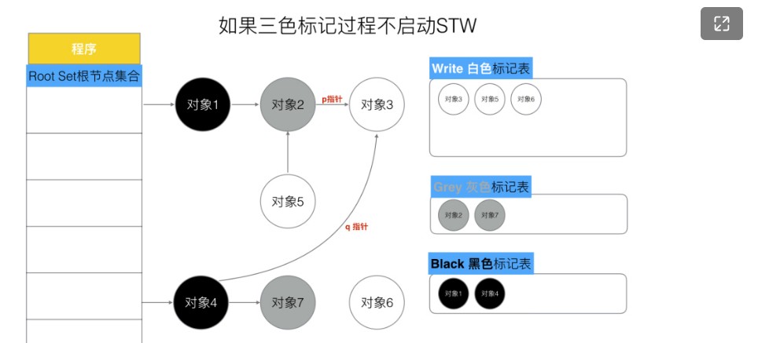

# GC（垃圾回收）

## 三色-标记清除算法

朴素的标记—清除算法（V1.3）会带来长时间的STW，这是不能容忍的，因此多数现代追踪式垃圾收集器会实现三色标记算法来缩短STW的时间，注意，朴素的三色清除算法仍然需要STW，只是比朴素的标记清除算法时间要短。

- 白色对象 ：内存垃圾，内存将被回收
- 灰色对象：指向白色对象的对象，是一种不稳定的状态。
- 黑色对象：不指向白色对象的对象和从跟对象可达的对象

三色标记清除算法的步骤：

1. 刚开始所有的对象都是白色对象，Root Set根节点集合中的对象是黑色对象；
2. 将与黑色直接相连的对象标记为灰色对象，并放入灰色对象集合中；
3. 从灰色对象集合中选择一个灰色对象标记为黑色，并放入黑色对象集合中
4. 重复2、3步，直到没有灰色对象。

1. 

可见上述步骤是需要STW，因为进程在执行过程中是可能修改对象的指针，例如，一个灰色对象突然不指向白色图像，同时一个黑色对象指向了白色对象，这个白色对象因为没有灰色对象的指向，将会被认定成垃圾，但是其实不是。

但是STW从头加到尾，那就和标记—清除算法一样了，区分三色就纯属没事找事了。

在三色清除算法中，下列条件同时发生时会出现对象被GC误杀的情况

1. 条件一：一个白色对象被黑色对象引用**(白色被挂在黑色下)**
2.  条件二：灰色对象与它之间的可达关系的白色对象遭到破坏**(灰色同时丢了该白色)**

## 公式

**强三色不变式**：不允许黑色对象引用白色对象，即只允许黑色引用灰色，灰色引用白色。

**弱三色不变式**：允许黑色对象引用白色对象，但是必须在这个白色对象被灰色对象直接引用或间接引用。这个

## 屏障机制

根据上述公式，出现了插入写屏障和删除写屏障

1. 插入写屏障：即当对象A引用对象B时，对象B就被标记成灰色。满足强三色不变式。注意，插入屏障只应用在堆上，不应用在栈上，因为go是并发运行的，大部分的操作都发生在栈上。数十万goroutine的栈都进行屏障保护自然会有性能问题。所以，堆上不会丢失任何对象，但是栈上会丢失，所以最后即将要清除白色对象之前，要短暂STW，检查栈上的对象，然后再清除。（V1.5）
2. 删除写屏障：即当A对象删除对B对象的引用时，如果B对象是白色，那么标记B对象为灰色。注意：删除屏障同时适用于栈和堆。但是这种方式回收精度低，因为即使一个对象失去了最后一个引用，这个对象仍然会被标记为灰色，仍然可以活过这一轮，但是在下一轮GC中被清理掉。GC开始时会有一个短暂的STW来记录快照，这个过程会保护开始时刻的所有存活对象。 

## 混合写屏障（V1.8）

混合屏障技仅仅应用在堆上，不会应用在栈上。

对于栈上的对象，当开始GC时，会将所有可达对象标记为黑色，同时在GC期间，任何在栈上创建的新对象，均为黑色。

混合写屏障流程：

1. 失去所有引用的对象标记为灰色
2. 对象A被添加到某一对象的下游，则A被标记为灰色。

## GC触发条件
自动垃圾回收的触发条件有两个：

超过内存大小阈值
达到定时时间

阈值是由一个gcpercent的变量控制的,当新分配的内存占已在使用中的内存的比例超过gcprecent时就会触发。比如一次回收完毕后，内存的使用量为5M，那么下次回收的时机则是内存分配达到10M的时候。也就是说，并不是内存分配越多，垃圾回收频率越高。
如果一直达不到内存大小的阈值呢？这个时候GC就会被定时时间触发，比如一直达不到10M，那就定时（默认2min触发一次）触发一次GC保证资源的回收。
