## GPM与CSP

CSP：Communicating Sequential Process，通信顺序进程，由Go语言中goroutine和channel来构成。Go语言在设计过程中，同时实现了GMP模型。

- G：groutine：Go程
- P：Processor：本地队列，存放等待运行的G，最多不能超过256个，通过GOMAXPROCS参数进行设置。子Go程会被优先放入同一个P。
- M：Machine，一个M直接关联了一个内核级线程。默认1w个。当没有足够的M来关联P并运行其中的可运行的G。比如所有的M此时都阻塞住了，而P中还有很多就绪任务，就会去寻找空闲的M，而没有空闲的，就会去创建新的M。

**其中M和P并没有绝对的数量关系，当一个M阻塞时，与其绑定的P就会与他解绑，转头寻找另一个可以执行的M。**

管理员—g0：每个M都会绑定一个叫g0的初代goroutine，它在M的创建的时候创建，g0的主要工作就是goroutine的调度、垃圾回收等。

1. 普通Go程的默认栈大小是2KB，最大是1GB
2. G0这个go程默认栈大小是固定的8MB，不能扩容和缩容。

## 调度策略

1. work stealing机制：当本线程无可运行的 G 时，尝试从其他线程绑定的 P 偷取 G，而不是销毁线程，CAS操作
2. hand off机制：当本线程 M 因为 G 进行的系统调用阻塞时，线程释放绑定的 P，把 P 转移给其他空闲的 M’执行。当发生上线文切换时，需要对执行现场进行保护，以便下次被调度执行时进行现场恢复
3. 抢占机制
4. 全局队列机制

## 状态管理

**G的状态：**

1. idle：刚刚被分配，还没有进行初始化；
2. runnable：在运行队列中，还有没有 stack (栈)。不会执行用户代码；
3. running：可以执行代码，拥有栈的所有权。被赋予了内核线程 M 和处理器 P，不在运行队列中；
4. syscall：正在执行系统调用，拥有栈的所有权。被分配给了 M，不在运行队列上；
5. waiting：由于运行时而被阻塞，没有执行用户代码。不在运行队列上，但是可能在记录在某地方( 比如在Channel 的等待队列上)，若需要时执行ready()唤醒；
6. copystack：发现需要扩容或者缩小栈空间，将协程的栈转移到新栈时的状态；
7. preempted：由于抢占而阻塞，和waiting 很像
8. scanxx：垃圾回收阶段的状态
9. 除此之外，还有几种保存状态。

**P的状态：**

1. idle：没有运行普通的g和g0
2. running：当前P被线程 M 持有，并且正在执行用户代码或者调度器
3. syscall：当前P与一个正在进行系统调用的 M 关联着，但并不属于这个 M。 p 可能会被其他 M偷走
4. gcstop：正在stw
5. dead：当前P已经不被使用(如动态调小 GOMAXPROCS)

## 函数管理

1. 有时候我们会主动调用 `runtime.Gosched()` 让出 goroutine 的 cpu 执行。比如自旋锁的实现，如果我们发现锁被占用，就直接让出 cpu
2. gopark的作用：
   1. 将running状态的goroutine设置为waiting
   2. 解除goroutine和当前工作线程M的关系

## g0调度多场景分析

1. 场景一：P拥有G1，M1获取P后开始运行G1，G1使用`go func()`创建了G2，为了局部性G2优先加入到P1的本地队列。

   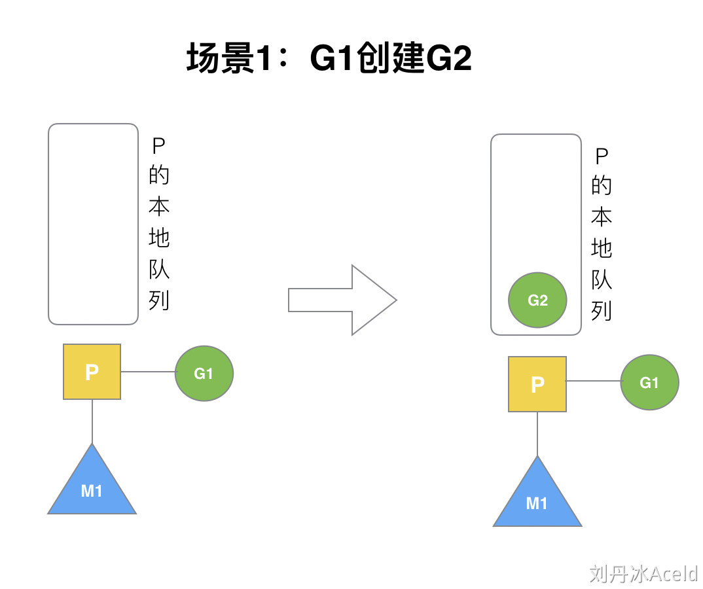

2. 场景二：G1运行完成后(函数：`goexit`)，M上运行的goroutine切换为G0，G0负责调度时协程的切换（函数：`schedule`）。从P的本地队列取G2，从G0切换到G2，并开始运行G2(函数：`execute`)。实现了线程M1的复用。

   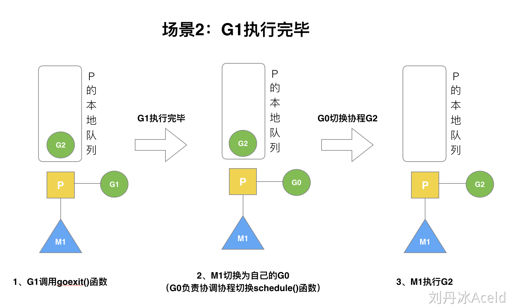

3. 场景三：假设每个P的本地队列只能存4个G。G2要创建了4个G，前4个G（G3, G4, G5, G6）已经加入p1的本地队列，p1本地队列满了。

   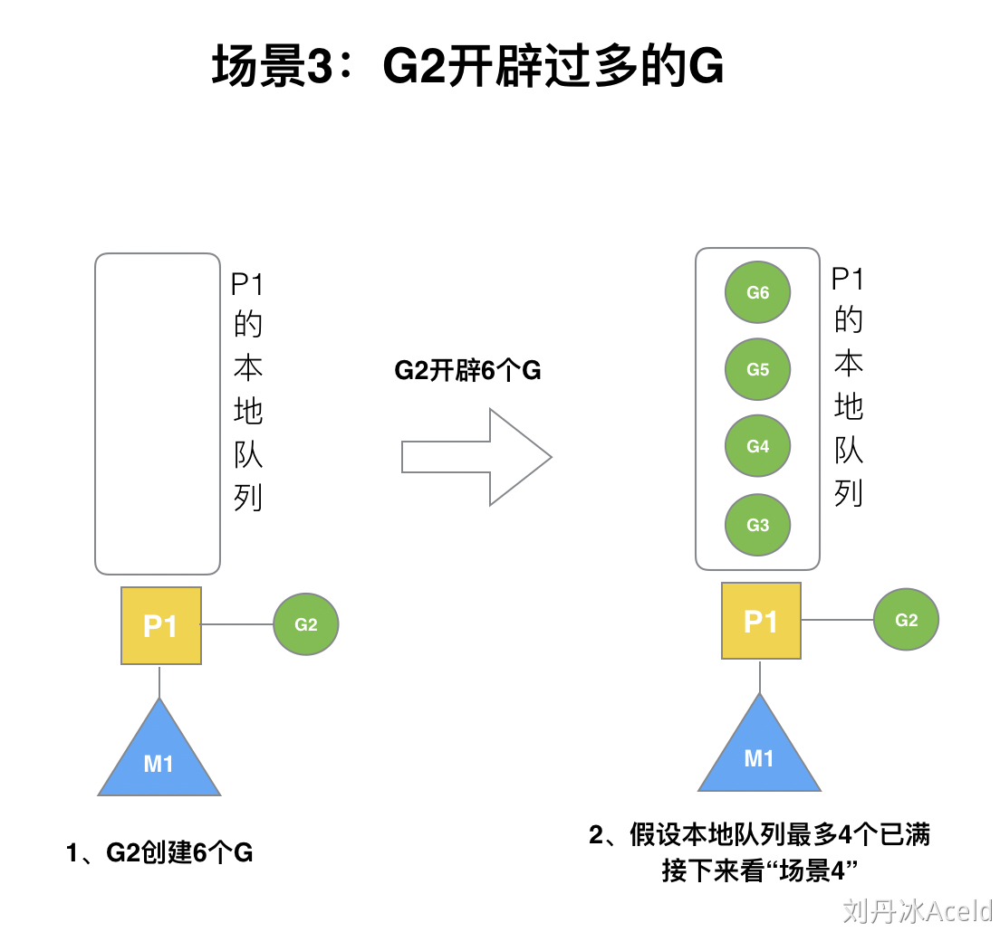

4. 场景四：G2在创建G7的时候，发现P1的本地队列已满，需要执行**负载均衡**(把P1中本地队列中前一半的G，还有新创建G**转移**到全局队列)，这些G被转移到全局队列时，会被打乱顺序。所以G3,G4,G7被转移到全局队列。

   注意：实现中并不一定是新的G，如果G是G2之后就执行的，会被保存在本地队列，把新G加入到全局队列）

   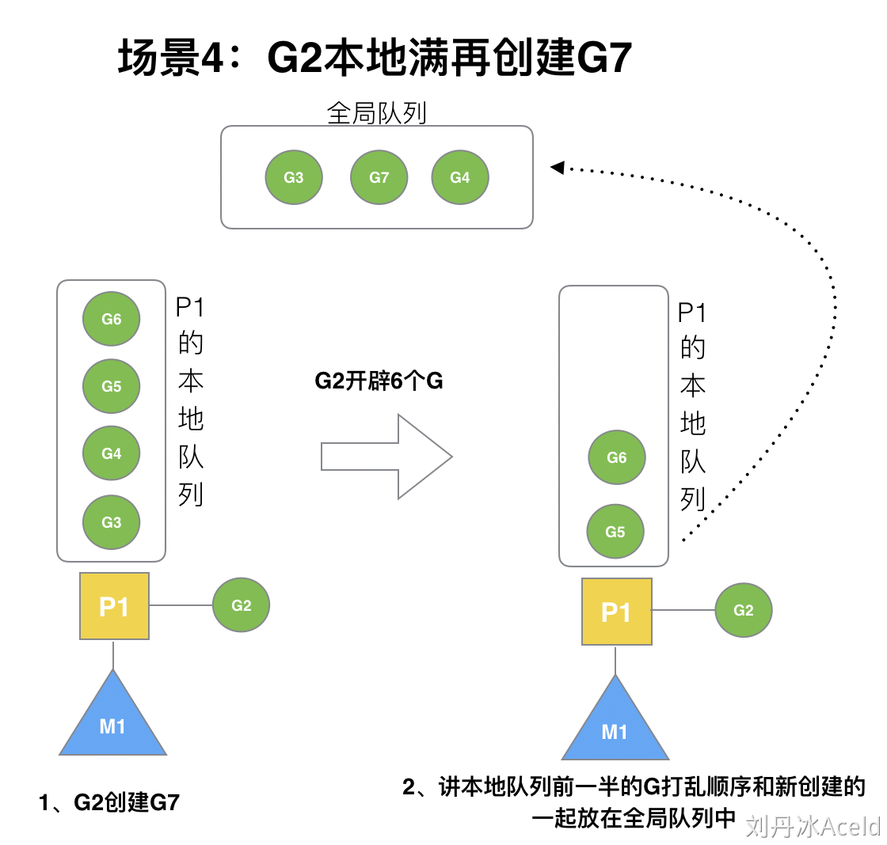

   5. 场景五：G2创建G8时，P1的本地队列未满，所以G8会被加入到P1的本地队列。G8加入到P1点本地队列的原因还是因为P1此时在与M1绑定，而G2此时是M1在执行。所以G2创建的新的G会优先放置到自己的M绑定的P上。

      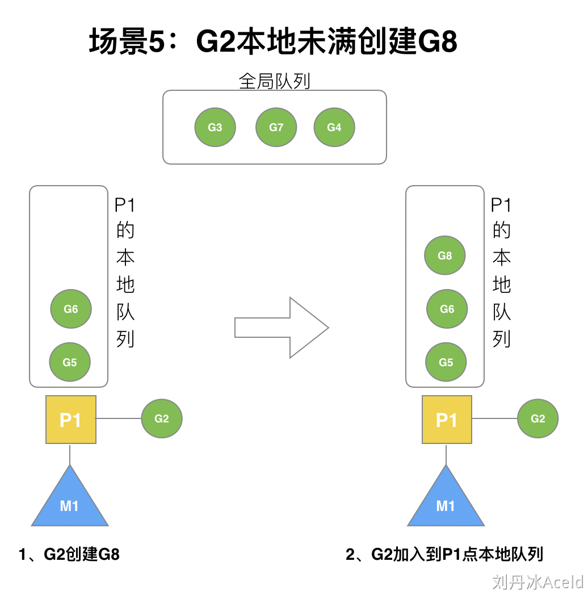

   6. 场景六：当创建一个G时，创建完成G后将G放入本地队列，父G会尝试唤醒一个空闲M组合去执行，M被唤醒后与一个P绑定，找不到P就接着睡眠。假定G2唤醒了M2，M2绑定了P2，并运行G0，但P2本地队列没有G，M2此时为自旋线程**（没有G但为运行状态的线程，不断寻找G）**

      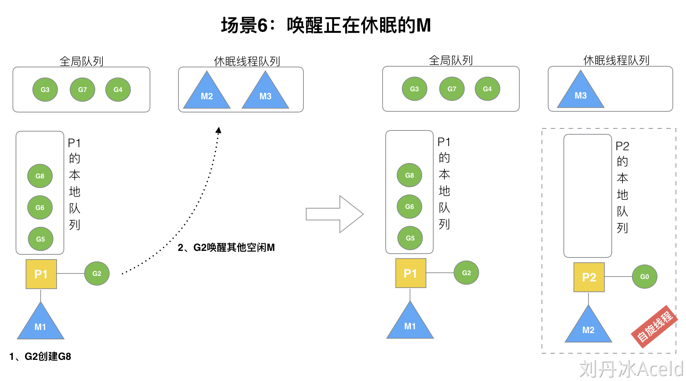

   7. 场景六：M2尝试从全局队列(简称“GQ”)取一批G放到P2的本地队列（函数：`findrunnable()`）。M2从全局队列取的G数量符合下面的公式：
      $$
      n =  min(全局队列中g的个数 / p的个数 +  1, 全局队列中g的个数 / 2 )
      $$
      至少从全局队列取1个g，但每次不要从全局队列移动太多的g到p本地队列，给其他p留点。这是**从全局队列到P本地队列的负载均衡**。

      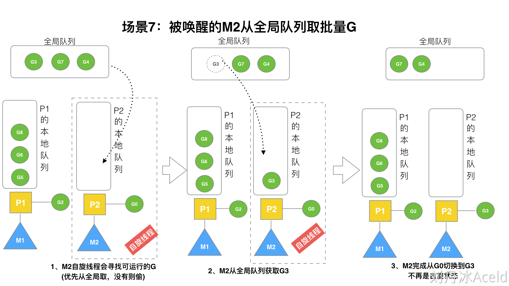

      7. 场景七：偷取G的情况。假设G2一直在M1上运行，经过2轮后，M2已经把G7、G4从全局队列获取到了P2的本地队列并完成运行，全局队列和P2的本地队列都空了。从其他有G的P哪里偷取一半G过来，放到自己的P本地队列。P2从P1的本地队列尾部取一半的G，本例中一半则只有1个G8，放到P2的本地队列并执行。

         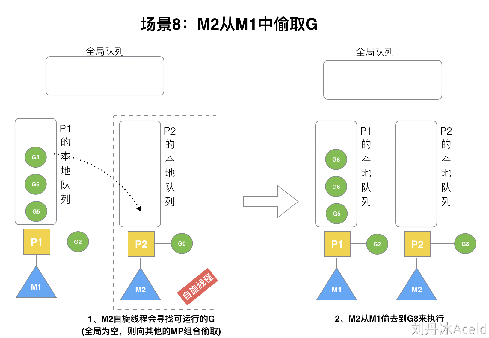

         8. 场景八：自旋线程的最大限制。G1本地队列G5、G6已经被其他M偷走并运行完成，当前M1和M2分别在运行G2和G8，M3和M4没有goroutine可以运行，M3和M4处于**自旋状态**，它们不断寻找goroutine。为什么要让m3和m4自旋，自旋本质是在运行，线程在运行却没有执行G，就变成了浪费CPU.  为什么不销毁现场，来节约CPU资源。因为创建和销毁CPU也会浪费时间，我们**希望当有新goroutine创建时，立刻能有M运行它**，如果销毁再新建就增加了时延，降低了效率。当然也考虑了过多的自旋线程是浪费CPU，所以系统中最多有`GOMAXPROCS`个自旋的线程(当前例子中的`GOMAXPROCS`=4，所以一共4个P)，多余的没事做线程会让他们休眠。

            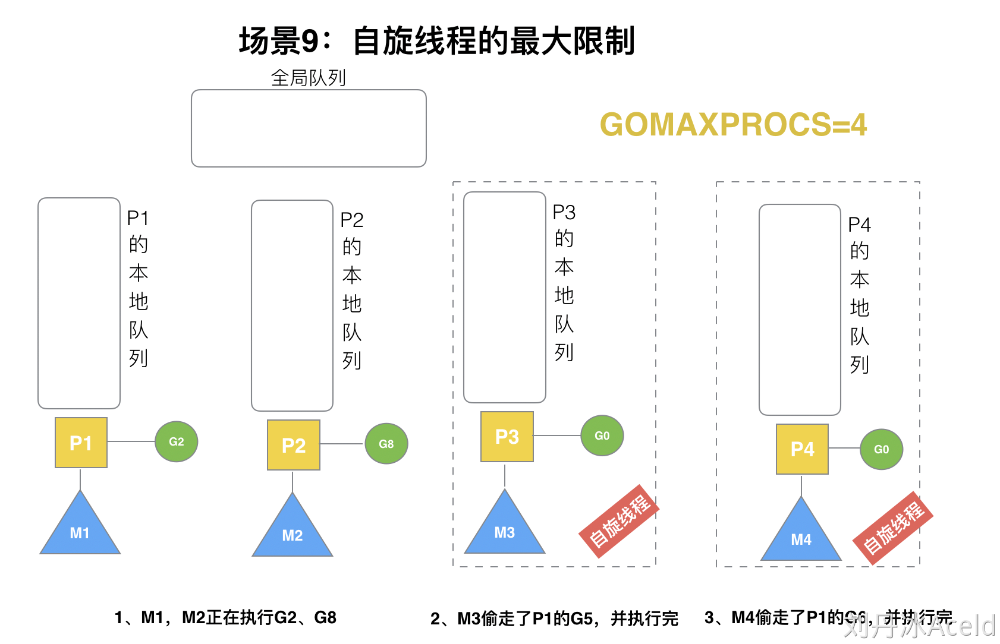

            10. 场景十：当G发生阻塞或系统调用。假定当前除了M3和M4为自旋线程，还有M5和M6为空闲的线程(没有得到P的绑定，注意我们这里最多就只能够存在4个P，所以P的数量应该永远是M>=P, 大部分都是M在抢占需要运行的P)，G8创建了G9，G8进行了**阻塞的系统调用**，M2和P2立即解绑，P2会执行以下判断：如果P2本地队列有G、全局队列有G或有空闲的M，P2都会立马唤醒1个M和它绑定，否则P2则会加入到空闲P列表，等待M来获取可用的p。本场景中，P2本地队列有G9，可以和其他空闲的线程M5绑定。

                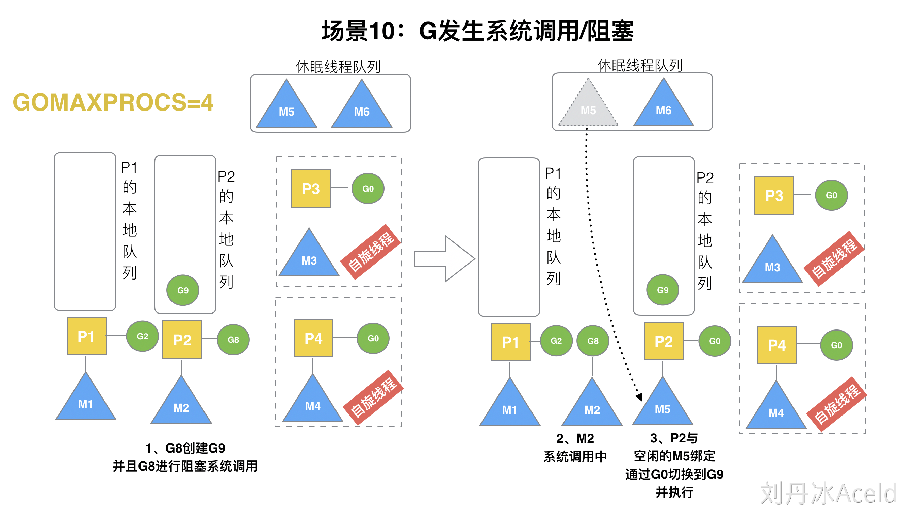

            11. 场景十一：G发生非阻塞系统调用。M2和P2会解绑，但M2会记住P2，然后G8和M2进入**系统调用**状态。当G8和M2退出系统调用时，会尝试获取P2，如果无法获取，则获取空闲的P，如果依然没有，G8会被记为可运行状态，并加入到全局队列,M2因为没有P的绑定而变成休眠状态(长时间休眠等待GC回收销毁)。

                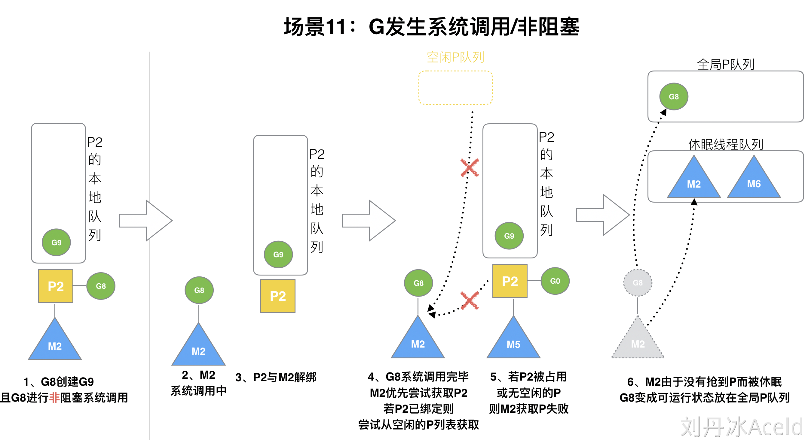

   

## M0和G0

1. M0是启动Go程序后的创建的第一个线程，然后创建M0的G0，再创建main goroutine，为main goroutine寻找一个P，将M0与P绑定，G0调用main goroutine，M0执行main goroutine，时间片到了，将main goroutine放回。
2. G0是每创建一个M后，都会自动创建的第一个G，作用相当于内核，G0仅用于负责调度其他的G，G0不指向任何可执行的函数, 每个M都会有一个自己的G0。在调度和系统调用时会使用G0的栈空间。 全局变量的G0是M0的G0。

详细过程：

1. runtime创建最初的线程m0和goroutine g0，并把2者关联。
2. 调度器初始化：初始化m0、栈、垃圾回收，以及创建和初始化由GOMAXPROCS个P构成的P列表。
3. main函数是`main.main`，`runtime`中也有1个main函数——`runtime.main`，代码经过编译后，`runtime.main`会调用`main.main`，程序启动时会为`runtime.main`创建goroutine，称它为main goroutine吧，然后把main goroutine加入到P的本地队列。
4. 启动m0，m0已经绑定了P，会从P的本地队列获取G，获取到main goroutine。
5. G拥有栈，M根据G中的栈信息和调度信息设置运行环境
6. M运行G
7. G退出，再次回到M获取可运行的G，这样重复下去，直到`main.main`退出，`runtime.main`执行Defer和Panic处理，或调用`runtime.exit`退出程序。

## sysmon

sysmon是我们的保洁阿姨，它是一个M，又叫监控线程，不需要P就可以独立运行，每20us~10ms会被唤醒一次出来打扫卫生，主要工作就是回收垃圾、回收长时间系统调度阻塞的P、向长时间运行的G发出抢占调度等等。

