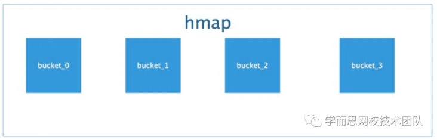
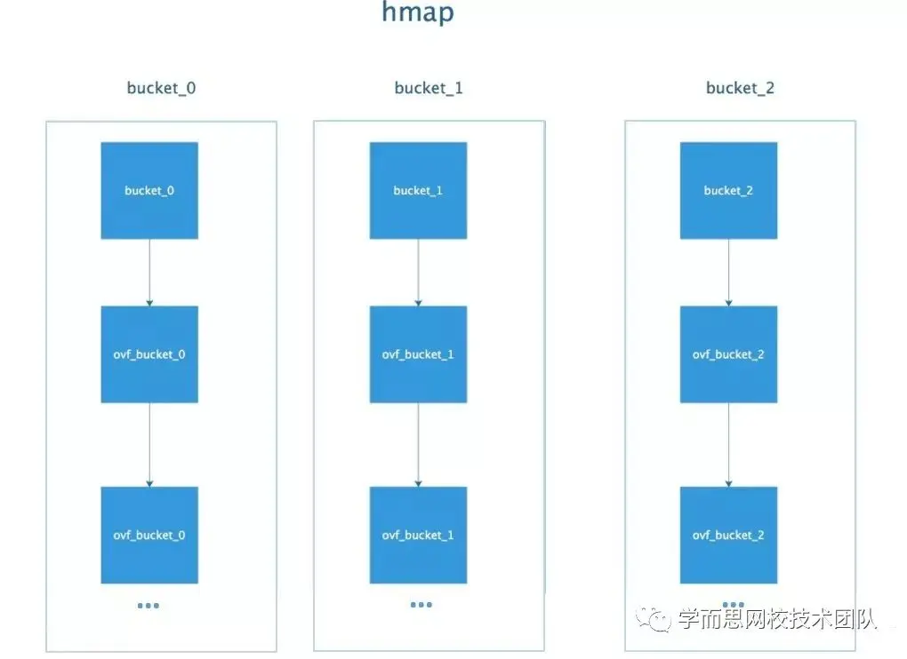

# slice的扩容机制

GO1.17版本及之前
当新切片需要的容量cap大于两倍扩容的容量，则直接按照新切片需要的容量扩容；
当原 slice 容量 < 1024 的时候，新 slice 容量变成原来的 2 倍；
当原 slice 容量 > 1024，进入一个循环，每次容量变成原来的1.25倍,直到大于期望容量。

GO1.18之后
当新切片需要的容量cap大于两倍扩容的容量，则直接按照新切片需要的容量扩容；
当原 slice 容量 < threshold 的时候，新 slice 容量变成原来的 2 倍；
当原 slice 容量 > threshold，进入一个循环，每次容量增加（旧容量+3*threshold）/4。

slice底层结构并没有使用加锁的方式,不支持并发读写

# Map
每个map的底层结构是hmap，hmap包含若干个结构为bmap的bucket数组。每个bucket底层都采用链表结构，一个bmap
用hash table，用链表来解决冲突 ，出现冲突时，不是每一个key都申请一个结构通过链表串起来，而是以bmap为最小粒度挂载，一个bmap可以放8个kv。在哈希函数的选择上，会在程序启动时，检测 cpu 是否支持 aes，如果支持，则使用 aes hash，否则使用 memhash。

bmap 就是我们常说的“桶”，桶里面会最多装 8 个 key，这些 key 之所以会落入同一个桶，是因为它们经过哈希计算后，哈希结果是“一类”。在桶内，又会根据 key 计算出来的 hash 值的高 8 位来决定 key 到底落入桶内的哪个位置（一个桶内最多有8个位置)。同时 bmap 有一个 overflow 的字段，是指针类型的，破坏了 bmap 不含指针的设想，这时会把 overflow 移动到 hmap的extra 字段来。

## 读取
map 对 key 进行 hash 运算，然后取低 B 位，以确定 key 在桶里的位置。

当得到桶的位置后，会继续取 hash 值的高 8 位得到 top hash，然后遍历 tophash 数组，寻找到 top hash 元素的 index 位置。

如果当前找不到，但 overflow 不为空，则遍历overflow的tophash数组，寻找到 top hash 元素的 index 位置。

当找到 top hash 的 index 位置后，也就确定了 key 在 keys 数组里的索引位置了，此时会再比较一下是否跟想寻找的 key 相等。

如果相等，则说明找到 key 了，就可以到 values 数组上的相同 index 位置提取 value 了。

如果不一样，则说明还得继续遍历寻找，直到没有元素，也没有 overflow 可继续遍历

## 扩容
随着向 map 中添加的 key 越来越多，key 发生碰撞的概率也越来越大。bucket 中的 8 个 cell 会被逐渐塞满，查找、插入、删除 key 的效率也会越来越低。最理想的情况是一个 bucket 只装一个 key，这样，就能达到 O(1) 的效率，但这样空间消耗太大，用空间换时间的代价太高。Go 语言采用一个 bucket 里装载 8 个 key，定位到某个 bucket 后，还需要再定位到具体的 key，这实际上又用了时间换空间。当然，这样做，要有一个度，不然所有的 key 都落在了同一个 bucket 里，直接退化成了链表，各种操作的效率直接降为 O(n)，是不行的。因此，需要有一个指标来衡量前面描述的情况，这就是 装载因子。

## 扩容机制
扩容时机：向 map 插入新 key 的时候，会进行条件检测，符合下面这 2 个条件，就会触发扩容

扩容条件：
1. 超过负载 map元素个数 > 6.5（负载因子） * 桶个数
2. 溢出桶太多
当桶总数<2^15时，如果溢出桶总数>=桶总数，则认为溢出桶过多
当桶总数>2^15时，如果溢出桶总数>=2^15，则认为溢出桶过

扩容机制：
双倍扩容：针对条件1，新建一个buckets数组，新的buckets大小是原来的2倍，然后旧buckets数据搬迁到新的buckets。
等量扩容：针对条件2，并不扩大容量，buckets数量维持不变，重新做一遍类似双倍扩容的搬迁动作，把松散的键值对重新排列一次，使得同一个 bucket 中的 key 排列地更紧密，节省空间，提高 bucket 利用率，进而保证更快的存取。

## 迁移工作
插入修改删除key的时候，都会尝试进行搬迁桶的工作，每次都会检查oldbucket是否nil，如果不是nil则每次搬迁2个桶，蚂蚁搬家一样渐进式扩容
渐进式扩容的扩容就体现在插入删除和修改kv的时候，在扩容的时候不仅会将key所在的旧桶迁移，并且顺带迁移一个桶，即一共迁移2个桶，并指向下一个待迁移的桶； 该函数返回的是一个内存地址，也就是key对应的value的内存地址，将value的值放入到该内存地址中即可。应该是由其他编译代码完成

## map遍历是无序的
map每次遍历,都会从一个随机值序号的桶,再从其中随机的cell开始遍历,并且扩容后,原来桶中的key会落到其他桶中,本身就会造成失序
如果想顺序遍历map,先把key放到切片排序,再按照key的顺序遍历map

## map解决冲突的方式
GO采用链地址法解决冲突，具体就是插入key到map中时，当key定位的桶填满8个元素后，将会创建一个溢出桶，并且将溢出桶插入当前桶的所在链表尾部

# channel
1. 通过var声明或者make函数创建的channel变量是一个存储在函数栈帧上的指针，占用8个字节，指向堆上的hchan结构体
2. channel分为无缓冲和有缓冲两种。 对于有缓冲的channel存储数据，使用了 ring buffer（环形缓冲区) 来缓存写入的数据，本质是循环数组 为啥是循环数组？普通数组不行吗，普通数组容量固定更适合指定的空间，弹出元素时，普通数组需要全部都前移 
当下标超过数组容量后会回到第一个位置，所以需要有两个字段记录当前读和写的下标位置
3. 还有读等待队列和写等待队列，用来存储goroutine
4. 还有互斥锁，保证读写channel时不存在并发竞争问题
5. 发送时:
   1. 如果 channel 的读等待队列存在接收者goroutine 
      1. 将数据**直接发送**给第一个等待的 goroutine， **唤醒接收的 goroutine**
   2. 如果 channel 的读等待队列不存在接收者goroutine 
      1. 如果循环数组buf未满，那么将会把数据发送到循环数组buf的队尾 
      2. 如果循环数组buf已满，这个时候就会走阻塞发送的流程，将当前 goroutine 加入写等待队列，并**挂起等待
6. 接收时:
   1. 如果 channel 的写等待队列存在发送者goroutine 
      1. 如果是无缓冲 channel，**直接**从第一个发送者goroutine那里把数据拷贝给接收变量，**唤醒发送的 goroutine**
      2. 如果是有缓冲 channel（已满），将循环数组buf的队首元素拷贝给接收变量，将第一个发送者goroutine的数据拷贝到 buf循环数组队尾，**唤醒发送的 goroutine**
   2. 如果 channel 的写等待队列不存在发送者goroutine 
      1. 如果循环数组buf非空，将循环数组buf的队首元素拷贝给接收变量 
      2. 如果循环数组buf为空，这个时候就会走阻塞接收的流程，将当前 goroutine 加入读等待队列，并**挂起等待唤醒**

