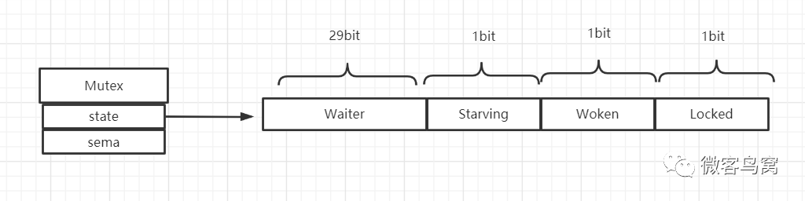

# sync.Mutex

不是可重入锁，golang中没有可重入锁的概念。

```golang
type Mutex struct {
 state int32 // 锁状态，
 sema  uint32 // 信号量
}
```

- state : 该互斥锁的状态，4个字节被分成了4份。
- sema : 表示信号量，这里代表被阻塞的Goroutine队列。对 mutex.sema 的地址通过哈希计算来生成一个 table，该表有一个semaRoot对象，该对象包含一个 `treap *sudog` 链表结构队列。

## state

state 是32位的整型变量，内部实现是把它分成了四份，用来记录 Mutex 的四种状态。Mutex 的内部布局：



- Waiter: 表示阻塞等待锁的协程个数，协程解锁时根据此值来判断是否需要释放信号量。
- Starving：表示该 Mutex 是否处理饥饿状态，
  - 0：正常状态
  - 1：饥饿状态，说明有协程阻塞了超过1ms。
- Woken: 表示是否有协程已被唤醒。Woken 状态用于加锁和解锁过程的通信，例如，同一时刻，两个协程一个在加锁，一个在解锁，在加锁的协程可能在自旋过程中，此时把 Woken 标记为 1，用于通知解锁协程不必释放信号量了。
  - 0：没有协程唤醒 
  - 1：已有协程唤醒，正在加锁过程中。
- Locked: 表示该 Mutex 是否已被锁定，
  - 0：没有锁定 
  - 1：已被锁定。


## 流程分析

- 简单加锁：假设当前只有一个协程在加锁，且没有其他协程来抢锁。加锁会查看 Locked 标志位是否为 0，若为 0 则改为 1，表示加锁成功。
- 简单解锁：假设解锁时，没有其他阻塞协程等待。所以此时解锁时只需要把 Locked 位改为 0 即可，不需要释放信号量。
- 复杂加锁：假设加锁时，锁已经被其他协程占用了。当 B协程对一个已被占用的锁再次加锁时，Waiter 计数器增加了1，此时 B 协程将被阻塞，直到 Locked 值变为0后才会被唤醒。
- 复杂解锁：假设解锁时，有1个或多个阻塞协程等待。A协程解锁分为两个步，一是把 Locked 位置0，二是查看到 Waiter>0，所以释放一个信号量，唤醒一个阻塞的协程，被唤醒的B协程把 Locked 位改为 1，于是 B协程获得锁。

### 自旋过程

- 加锁时，如果当前 Locked 位为 1，则说明该锁当前是由其他协程持有，尝试加锁的协程并不会马上转入阻塞，而是**会持续的探测 Locked 位是否变为 0**，这个过程即为自旋过程。
- 自旋的时间很短，但如果在自旋过程中发现锁已被释放，那么协程可以立即获取锁。此时即便有协程被唤醒也无法获取锁，只能再次阻塞。
- 自旋的好处是，当加锁失败时不必立即转入阻塞，有一定机会获取到锁，这样可以避免协程的切换。

### 自旋的条件

- 旋的次数要足够小，通常为4，即**「自旋最多为4次」**
- CPU 核数要大于1，否则自旋是没有意义的，因为此时不可能有其他协程释放锁
- 协程调度机制中的 Process 数量要大于 1，比如使用 GOMAXPROCS() 将处理器设置为 1 就不能启用自旋
- 协程调度机制中的可运行队列必须为空，否则会延迟协程调度

### 自旋出现的问题

如果自旋过程中获得锁，那么之前被阻塞的协程将无法获得锁，如果争抢锁的协程特别多，每次都通过自旋获得锁，那么之前被阻塞的进程将很难获得锁，从而进入**「饥饿状态」**。

为了避免协程长时间无法获取锁，自1.8版本以来增加了一个状态，即 Mutex 的 Starving 状态。这个状态下不会自旋，一旦有协程释放锁，那么一定会唤醒一个协程并成功加锁。

1. 正常状态：默认情况下，Mutex的模式为normal。在该模式下，协程如果加锁不成功立即会转入阻塞队列，而是判断是否自旋条件，如果满足，就会启动自旋过程，尝试抢锁。正常模式下waiter都是先入先出，在队列中等待的waiter被唤醒后不会直接获取锁，因为要和新来的goroutine 进行竞争，新来的goroutine相对于被唤醒的waiter是具有优势的，新的goroutine 正在cpu上运行，被唤醒的waiter还要进行调度才能进入状态，所以在并发的情况下waiter大概率抢不过新来的goroutine，这个时候waiter会被放到队列的头部，如果等待的时间超过了1ms，这个时候Mutex就会进入饥饿模式。 
2. 饥饿状态：正常状态下的队头goroutine抢锁时，此时发现锁已被抢占了，自己只好再次阻塞，不过阻塞前会判断自上次阻塞到本次阻塞经过了多长时间，如果超过 1ms 的话，会将 Mutex 标记为”饥饿”模式，然后 再阻塞。 处于饥饿模式下，不会启动自旋过程，也即一旦有协程释放了锁，那么一定会唤醒协程，被唤醒的协程将会成功获取锁，同时也会把等待计数减 1。 

