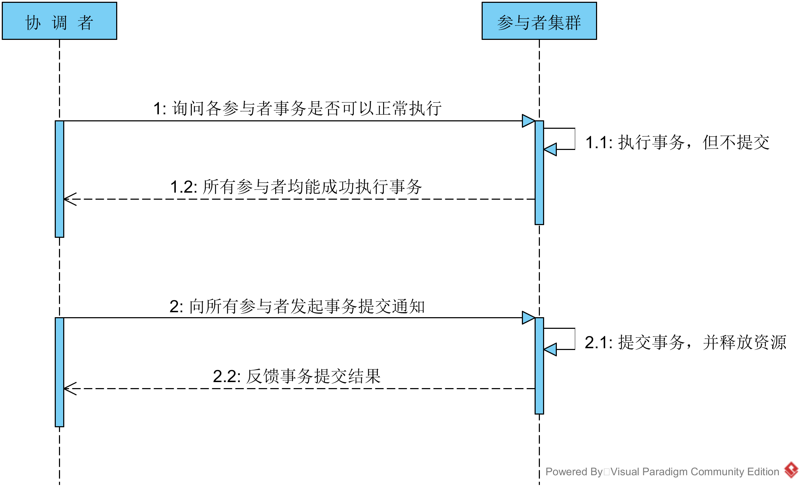
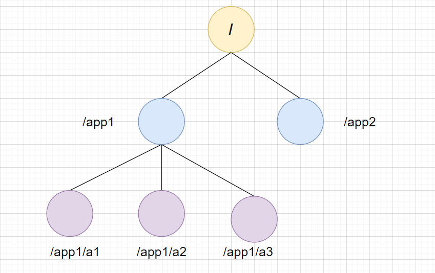
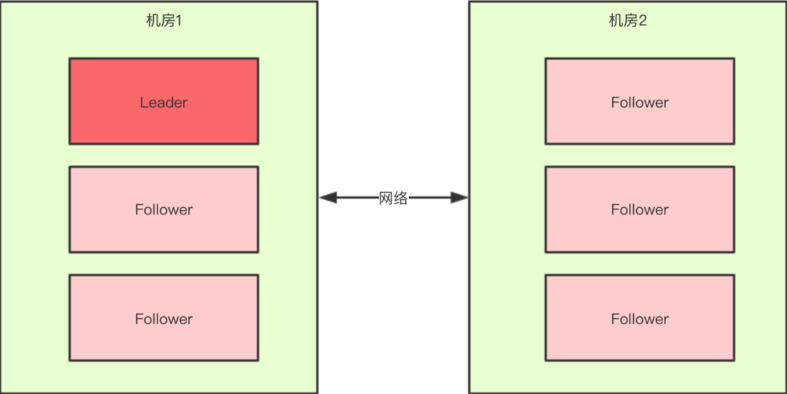
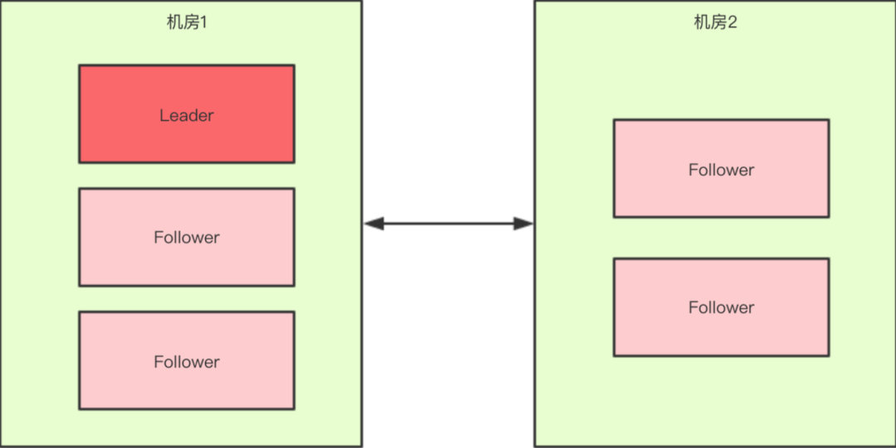

# 注册中心—zookeeper

## CAP理论

1. consistency：一致性，所有节点在同一时间具有相同的数据；
2. available：可用性，保证每个请求不管成功或者失败都有响应；
3. partition：分割容忍，系统中任意信息的丢失或失败不会影响系统的继续运作。

关于 P 的理解，我觉得是在整个系统中某个部分，挂掉了，或者宕机了，并不影响整个系统的运作或者说使用，而可用性是，某个系统的某个节点挂了，但是并不影响系统的接受或者发出请求。

CAP 不可能都取，只能取其中2个的原因如下：

- 如果C是第一需求的话，那么会影响A的性能，因为要数据同步，不然请求结果会有差异，但是数据同步会消耗时间，期间可用性就会降低。
- 如果A是第一需求，那么只要有一个服务在，就能正常接受请求，但是对于返回结果变不能保证，原因是，在分布式部署的时候，数据一致的过程不可能想切线路那么快。
- 再如果，同时满足一致性和可用性，那么分区容错就很难保证了，也就是单点，也是分布式的基本核心。

## 两阶段提交协议

为了支持分布式事务，保证分布式系统中数据的一致性。将一个分布式事务拆成两个阶段：投票和事务提交。整个系统包含两个角色，协调者和参与者。

在ZK协议中，只要有超过一半（不是等于1半）回复了，则可以提交。

## Zookeeper

ZooKeeper是非常经典的服务注册中心中间件，在国内环境下，由于受到Dubbo框架的影响，大部分情况下认为Zookeeper是RPC服务框架下注册中心最好选择，随着Dubbo框架的不断开发优化，和各种注册中心组件的诞生，即使是RPC框架，现在的注册中心也逐步放弃了ZooKeeper。在常用的开发集群环境中，ZooKeeper依然起到十分重要的作用，Java体系中，大部分的集群环境都是依赖ZooKeeper管理服务的各个节点。

## 数据模型

ZooKeeper的视图数据结构，很像Unix文件系统，也是树状的，这样可以确定每个路径都是唯一的。zookeeper的节点统一叫做「znode」，它是可以通过「路径来标识」，结构图如下：

**znode的4种类型**

根据节点的生命周期，znode可以分为4种类型，分别是持久节点(PERSISTENT)、持久顺序节点(PERSISTENT_SEQUENTIAL)、临时节点(EPHEMERAL)、临时顺序节点(EPHEMERAL_SEQUENTIAL)

**持久节点(PERSISTENT)**

这类节点被创建后，就会一直存在于Zk服务器上。直到手动删除。

**持久顺序节点(PERSISTENT_SEQUENTIAL)**

它的基本特性同持久节点，不同在于增加了顺序性。父节点会维护一个自增整性数字，用于子节点的创建的先后顺序。

**临时节点(EPHEMERAL)**

临时节点的生命周期与客户端的会话绑定，一旦客户端会话失效(非TCP连接断开)，那么这个节点就会被自动清理掉。zk规定临时节点只能作为叶子节点。

**临时顺序节点(EPHEMERAL_SEQUENTIAL)**

基本特性同临时节点，添加了顺序的特性。

## Leader选举

zookeeper 的 leader 选举存在两个阶段，一个是服务器启动时 leader 选举，另一个是运行过程中 leader 服务器宕机

- 服务器 ID(myid)：编号越大在选举算法中权重越大
- 事务 ID(zxid)：值越大说明数据越新，权重越大
- 逻辑时钟(epoch-logicalclock)：同一轮投票过程中的逻辑时钟值是相同的，每投完一次值会增加。即第几轮

**选举状态：**

- **LOOKING**: 竞选状态
- **FOLLOWING**: 随从状态，同步 leader 状态，参与投票
- **OBSERVING**: 观察状态，同步 leader 状态，不参与投票
- **LEADING**: 领导者状态

### 启动时leader选举

每个节点启动的时候都 LOOKING 观望状态，接下来就开始进行选举。这里选取5台机器组成的集群为例

1. 服务器 1 启动

发起一次选举，服务器 1 投自己一票，此时服务器 1 票数一票，不够半数以上（3 票），选举无法完成。

投票结果：服务器 1 为 1 票。

服务器 1 状态保持为 LOOKING。

2. 服务器 2 启动

发起一次选举，服务器 1 和 2 分别投自己一票，此时服务器 1 发现服务器 2 的 id 比自己大，更改选票投给服务器 2。

投票结果：服务器 1 为 0 票，服务器 2 为 2 票。**（这里是服务1收到了服务2的投票，然后比较了zxid，都为0，又比较myid，发现2比1大，所以又向各服务器发送自己新的投票（投服务器2））**

服务器 1，2 状态保持 LOOKING。

3. 服务器 3 启动

发起一次选举，因为服务器 3 的 id 最大，两者更改选票投给为服务器 3；

投票结果：服务器 1 为 0 票，服务器 2 为 0 票，服务器 3 为 3 票。此时服务器 3 的票数已经超过半数（3 票），服务器 3 当选 Leader。

服务器 1，2 更改状态为 FOLLOWING，服务器 3 更改状态为 LEADING。

4. 服务器4启动

发起一次选举，此时服务器 1，2，3 已经不是 LOOKING 状态，不会更改选票信息。交换选票信息结果：服务器 3 为 3 票，服务器 4 为 1 票。此时服务器 4 服从多数，更改选票信息为服务器 3。

服务器 4 并更改状态为 FOLLOWING。

5. 服务器 5 启动

与服务器 4 一样投票给 3，此时服务器 3 一共 5 票，服务器 5 为 0 票。

服务器 5 并更改状态为 FOLLOWING。

最终的结果：

服务器3是 Leader，状态为 LEADING；其余服务器是 Follower，状态为 FOLLOWING。

### 运行过程中的Leader选举

在 ZooKeeper 运行期间 Leader 和 非 Leader 各司其职，当有非 Leader 服务器宕机或加入不会影响 Leader，但是一旦 Leader 服务器挂了，那么整个 ZooKeeper 集群将暂停对外服务(因为是CP，这也是zookeeper的弊端)，会触发新一轮的选举。

初始状态下服务器 3 当选为 Leader，假设现在服务器 3 故障宕机了，此时每个服务器上 zxid 可能都不一样，server1 为 99，server2 为 102，server4 为 100，server5 为 101。

运行期选举与初始状态投票过程基本类似，大致可以分为以下几个步骤：

- 状态变更。Leader 故障后，余下的非 Observer 服务器都会将自己的服务器状态变更为 LOOKING，然后开始进入 Leader 选举过程。
- 每个 Server 会发出投票。
- 接收来自各个服务器的投票，如果其他服务器的数据比自己的新会改投票。
- 处理和统计投票，每一轮投票结束后都会统计投票，超过半数即可当选。
- 改变服务器的状态，宣布当选。

## zookeeper的特性

- 顺序一致性：从同一客户端发起的事务请求，最终将会严格地按照顺序被应用到 ZooKeeper 中去。
- 原子性：所有事务请求的处理结果在整个zookeeper集群中所有机器上的应用情况是一致的，也就是说，要么整个集群中所有的机器都成功应用了某一个事务，要么都没有应用。
- 单一视图：无论客户端连到哪一个 ZooKeeper 服务器上，其看到的服务端数据模型都是一致的。
- 可靠性： 一旦服务端成功地应用了一个事务，并完成对客户端的响应，那么该事务所引起的服务端状态变更将会被一直保留下来。
- 实时性(最终一致性)： Zookeeper 仅仅能保证在一定的时间段内，客户端最终一定能够从服务端上读取到最新的数据状态。

### zookeeper如何保证顺序一致性

需要了解事务ID，即zxid。ZooKeeper的在选举时通过比较各结点的zxid和机器ID选出新的主结点的。zxid由Leader节点生成，有新写入事件时，Leader生成新zxid并随提案一起广播，每个结点本地都保存了当前最近一次事务的zxid，zxid是递增的，所以谁的zxid越大，就表示谁的数据是最新的。

ZooKeeper集群是一主多从的结构：

- 如果是写入数据，先写入主服务器(主节点)，再通知从服务器（一半以上即可）。
- 如果是读取数据，既读主服务器的，也可以读从服务器的。

## 分布式锁

Zookeeper就是使用临时顺序节点特性实现分布式锁的。

- 获取锁过程 (创建临时节点，检查序号最小)
- 释放锁 (删除临时节点，监听通知)

1. **获取锁过程**

当第一个客户端请求过来时，Zookeeper客户端会创建一个持久节点/locks。如果它(Client1)想获得锁，需要在locks节点下创建一个顺序节点lock1.如图

2. 接着，客户端Client1会查找locks下面的所有临时顺序子节点，判断自己的节点lock1是不是排序最小的那一个，如果是，则成功获得锁。
3. 这时候如果又来一个客户端client2前来尝试获得锁，它会在locks下再创建一个临时节点lock2
4. 客户端client2一样也会查找locks下面的所有临时顺序子节点，判断自己的节点lock2是不是最小的，此时，发现lock1才是最小的，于是获取锁失败。获取锁失败，它是不会甘心的，client2向它排序靠前的节点lock1注册Watcher事件，用来监听lock1是否存在，也就是说client2抢锁失败进入等待状态。
5. 此时，如果再来一个客户端Client3来尝试获取锁，它会在locks下再创建一个临时节点lock3
6. 同样的，client3一样也会查找locks下面的所有临时顺序子节点，判断自己的节点lock3是不是最小的，发现自己不是最小的，就获取锁失败。它也是不会甘心的，它会向在它前面的节点lock2注册Watcher事件，以监听lock2节点是否存在。
7. 释放锁：我们再来看看释放锁的流程，zookeeper的「客户端业务完成或者故障」，都会删除临时节点，释放锁。如果是任务完成，Client1会显式调用删除lock1的指令，如果是客户端故障了，根据临时节点得特性，lock1是会自动删除的，lock1节点被删除后，Client2可开心了，因为它一直监听着lock1。lock1节点删除，Client2立刻收到通知，也会查找locks下面的所有临时顺序子节点，发下lock2是最小，就获得锁。

## 脑裂

出现两个leader。

ZooKeeper过半机制中为什么是大于，而不是大于等于？这就是与脑裂问题有关系了，比如回到上文出现脑裂问题的场景（如上图1）：共有6台机器，当机房中间的网络断掉之后，机房1内的三台服务器会进行领导者选举，但是此时过半机制的条件是“节点数 > 3”，也就是说至少要4台zkServer才能选出来一个Leader，所以对于机房1来说它不能选出一个Leader，同样机房2也不能选出一个Leader，这种情况下整个集群当机房间的网络断掉后，整个集群将没有Leader。而如果过半机制的条件是“节点数 >= 3”，那么机房1和机房2都会选出一个Leader，这样就出现了脑裂。这就可以解释为什么过半机制中是大于而不是大于等于，目的就是为了防止脑裂。

假设有5台机器

此时过半机制的条件是“节点数 > 2”，也就是至少要3台服务器才能选出一个Leader，此时机房件的网络断开了，对于机房1来说是没有影响的，Leader依然还是Leader，对于机房2来说是选不出来Leader的，此时整个集群中只有一个Leader。因此总结得出，有了过半机制，对于一个ZooKeeper集群来说，要么没有Leader，要么只有1个Leader，这样ZooKeeper也就能避免了脑裂问题。

### 解决脑裂

Quorums（法定人数）方式：比如3个节点的集群，Quorums = 2，也就是说集群可以容忍1个节点失效，这时候还能选举出1个lead，集群还可用。比如4个节点的集群，它的Quorums = 3，Quorums要超过3，相当于集群的容忍度还是1，如果2个节点失效，那么整个集群还是无效的。这是ZooKeeper防止“脑裂”默认采用的方法。