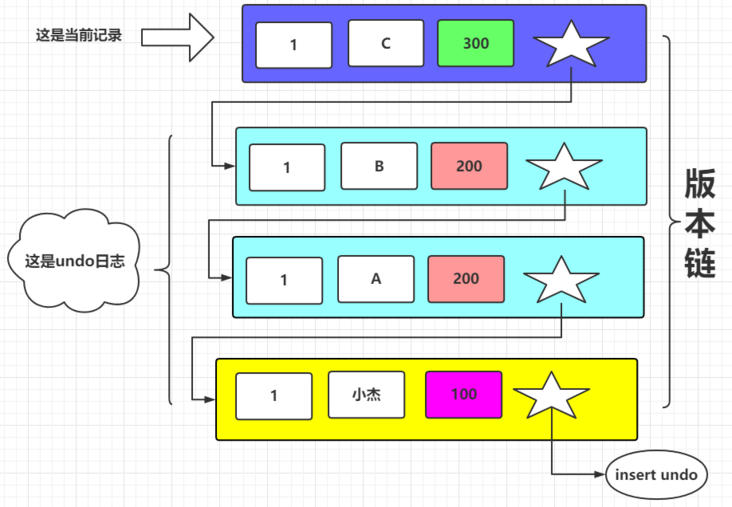
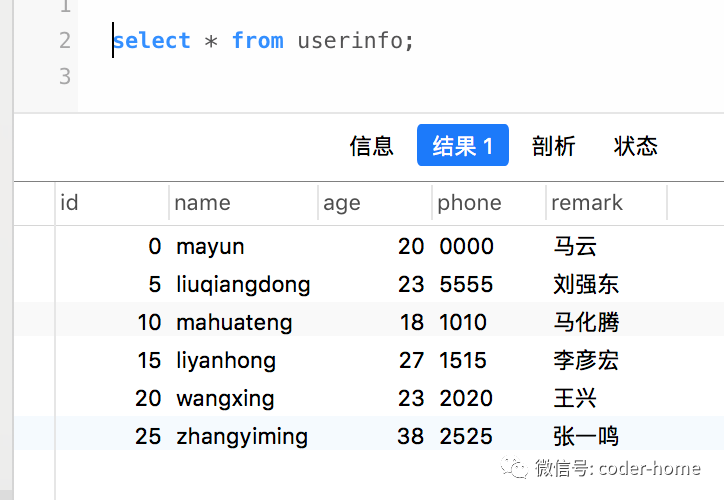

1. 一主一从：主要介绍主从复制中的问题
   1. https://leeshengis.com/archives/2-4----m-y-s-q-l-shi-zen-me-bao-zheng-zhu-bei-yi-zhi-de-
   2. binlog文件和位置
2. 一主多从：https://leeshengis.com/archives/2-7----zhu-ku-chu-wen-ti-le--cong-ku-zen-me-ban-
   1. 一主多从的切换问题：在一主多从的模式中，从库如何寻找新主库的日志位置是一个痛点，因此在5.6版本时引入了GTID协议。
   2. GTID的全称是Global Transaction Identifier，也就是全局事务ID，是一个事务在提交的时候生成的，是这个事务的唯一标识。它由两部分组成，格式是：GTID=server_uuid:gno 
   3. second_behind_master：表示从库和主库写入同一条语句的时间差，单位是s

## MVCC

多版本并发控制

1. 特别要注意MVCC只在 读已提交(RC) 和 可重复度（RR） 这两种事务隔离级别下才有效
2. 是 数据库引擎（InnoDB） 层面实现的，用来处理读写冲突的手段（不用加锁），提高访问性能

MVCC是怎么实现的呢？它靠的就是版本链和一致性视图

### 版本连

版本链是一条链表，链接的是每条数据曾经的修改记录，其实是这样的，对于InnoDB存储引擎的表来说，它的聚簇索引记录包含两个隐藏字段。

1. **trx_id:** 存储修改此数据的事务id，只有这个事务操作了某些表的数据后当更改操作发生的时候（update,delete,insert），才会分配唯一的事务id,并且此事务id是递增的
2. **roll_pointer:** 指针，指向上一次修改的记录



我们每更改一次数据，就会插入一条undo日志，并且记录的**roll_pointer**指针会指向上一条记录

### 一致性视图

需要判断版本链中的哪个版本是是当前事务可见的，因此有了一致性视图的概念。

1.  生成此数据的事务已经在生成readView前提交了， **可见**
2. 生成该数据的事务是在生成ReadView后才开启的， **不可见**

注：**RR和RC生成一致性视图的时机不一样** （这也是两种隔离级别实现的主要区别）

- 读提交（read committed RC） 是在**每一次**select的时候生成ReadView的

- 可重复读（repeatable read RR）是在**第一次**select的时候生成ReadView的

## 幻读

1. 含义：**幻读指的是一个事务在前后两次查询同一个范围的时候，后一次查询看到了前一次查询没有看到的行**。

2. **在可重复读隔离级别下，普通的查询是快照读，通过MVCC控制，是不会看到别的事务插入的数据的。因此， 幻读在“当前读”下才会出现（for update表示当前读）；**

3. 示例：

   数据展示：

   

   1. 可重复读+主键索引

      ```sql
      /*根据主键查询，给行增加X锁*/
      select * from userinfo where id = 5 for update;
      ```

      此时会在主键索引上索引值为5的记录上增加X锁，此时不需要使用其他间隙锁就可以避免幻读的发生。因为主键索引是唯一索引，当锁住这一行数据后，其他事务将不能做如下操作：

      1. 不能删除id=5的这一行数据。id=5的行已经被当前事务给增加了X锁，所以其他事务将不能查询、修改、删除这一行数据。
      2. 不能新插入一个id=5的行。表中已经存在主键id=5的行了，所以其他事务不能再次增加一个id=5的行。所以就可以避免在id=5这个条件下再次查询的时候出现多行数据而产生幻读的现象。
      3. 不能修改id=5的这一行数据。id=5的行已经被当前事务给增加了X锁，所以其他事务将不能查询、修改、删除这一行数据。
      4. 不能把其他行的id值改为5。这一行是主键索引，也是唯一所以，它的值不能重复。所以其他事务不能把一个id!=5的行改为id=5的行。所以就可以避免在id=5这个条件下再次查询的时候出现多行数据而出现幻读的现象。

   2. 可重复读+唯一索引

      ```sql
      /*根据唯一索引列查询，给行增加X锁*/
      select * from userinfo where phone = '5555' for update;
      ```

      此时查询数据的过程是这样的：先查唯一索引，然后再回表查询主键索引，然后从主键索引上返回查询的结果。具体流执行流程如下：

      - 先根据phone列上面的唯一索引找到索引值为'5555'索引记录，因为是唯一索引，所以找到`5555`
        的索引记录后就停止搜索了，索引树上只有一条`5555`的记录。
      - 然后再根据这个索引记录上面存储的主键索引的值`5`
        去主键索引上面查找需要查询的行记录。
      - 根据加锁规则中提到的：只会在扫描到的对象上增加锁。所以会在主键索引id=5的索引记录上增加X锁，也会在唯一索引phone='5555'的索引记录上增加一个X锁。

   3. 可重复读+非唯一索引

      ```sql
      select * from userinfo where age = 23 for update;
      ```

      - 除了在age=23的字段上添加X锁外，根据非唯一索引加锁规则，此次增加的间隙锁有：(20,23]、(23,27]。对于非唯一索引来说，当扫描到最后一个边界age=27的时候，临键锁退化为间隙锁。所以此时的锁为间隙锁：(20,27)，不包含左右两边的边界值20和27。

      - 行锁有：在age=23的非主键索引记录上有两个，因为有两个age=23索引记录。同时在id=5和id=20的主键索引记录上也有两把X锁
      - 只要当age的取值范围为(20,27)的时，任何记录行都不能插入成功。因为age上面的间隙锁阻止了数据的插入。
      - 当age=20的时候，并不是说，id的值可以使用任意表中不存在的主键值作为待插入的主键值。此时id的值必须为小于0的数，不能大于0。举例说明：当待插入的数据中的age=20, id=1，那么在非唯一索引age上面存这一行索引记录的时候，会在上图中的蓝色方框20后面在创建一个age=20的记录，还需要为这个非唯一索引下面村上主键索引(聚簇索引)的值：1，此时的1比表中已经存在的主键值0大，所以它会放在0的后面，如上图中所示此时的1会占用被锁住的索引间隙。所以此时不能插入成功。能插入成功的为：age=20, id=-1或age=20, id=-2这样的组合。
      - 当age=27的时候，同理，id的值需要大于15才可以插入成功。比如：age=27, id=16或者age=27, id=17这样的组合。如果此时插入一个age=27, id=14的数据行，你设想一下会怎么存放这个索引记录，索引中已经存在一个age=27, id=15的记录了，此时再来一个age=27, id=14的记录，那这个id=14的记录必须排在id=15的前面。而此时id=14的位置是被间隙锁锁住的。所以它是插入失败的

   4. 可重复读+普通字段，即没有任何索引的字段

      ```sql
      select * from userinfo where name = 'liuqiangdong' for update;
      ```

   上面的name没有任何索引。此时加锁的情况是这样的：因为name是一个普通的列，上面没有任何索引可以使用，所以根据这个条件进行搜索数据的时候，会进行全表扫描的操作，当搜索到第一个name='liuqiangdong'的数据行的时候，不会马上停下来，因为后面可能还有很多个name='liuqiangdong'的数据行，所以要进行全表扫描。根据前面我们说的加锁规则，凡是扫描到的对象都要加锁，**所以此时全表中的每一个主键索引记录上都有一个X锁。同时为了防止幻读的凡是，会对这个表上所有的主键索引的间隙也都增加上间隙锁。**

   1. https://www.modb.pro/db/74024

   
