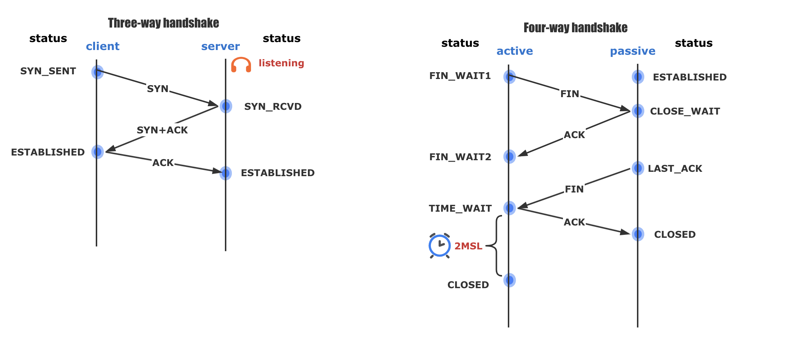

# 10. 提升TCP四次挥手的性能

close和shutdown函数都可以关闭连接，但这两种方式关闭的连接，不只功能上有差异，控制它们的Linux参数也不相同。

## 四次挥手流程

**四次挥手只涉及两种报文：FIN和ACK。**FIN就是Finish结束连接的意思，谁发出FIN报文，就表示它将不再发送任何数据，关闭这一方向的传输通道。ACK是Acknowledge确认的意思，它用来通知对方：你方的发送通道已经关闭。

当主动方关闭连接时，会发送FIN报文，此时主动方的连接状态由ESTABLISHED变为FIN_WAIT1。当被动方收到FIN报文后，内核自动回复ACK报文，连接状态由ESTABLISHED变为CLOSE_WAIT，顾名思义，它在等待进程调用close函数关闭连接。当主动方接收到这个ACK报文后，连接状态由FIN_WAIT1变为FIN_WAIT2，主动方的发送通道就关闭了。

再来看被动方的发送通道是如何关闭的。当被动方进入CLOSE_WAIT状态时，进程的read函数会返回0，这样开发人员就会有针对性地调用close函数，进而触发内核发送FIN报文，此时被动方连接的状态变为LAST_ACK。当主动方收到这个FIN报文时，内核会自动回复ACK，同时连接的状态由FIN_WAIT2变为TIME_WAIT，Linux系统下大约1分钟后TIME_WAIT状态的连接才会彻底关闭。而被动方收到ACK报文后，连接就会关闭。



## 主动方的优化

安全关闭连接的方式必须通过四次挥手，它由进程调用close或者shutdown函数发起，这二者都会向对方发送FIN报文（shutdown参数须传入SHUT_WR或者SHUT_RDWR才会发送FIN）。

调用shutdown和调用close的区别

- 调用shutdown后，传入SHUT_WR参数，指得是关闭写方向，表示进程无法写数据，但是仍然可以读数据；传入SHUR_RDWR，指的是关闭读方向和写方向，表示进程无法写数据和读数据。调用shutdown后，连接仍然属于该进程，因此连接不属于孤儿连接。
- 调用close后，进程无法读数据，也无法写数据，而且连接将变成孤儿连接，所谓孤儿连接就是这个连接已经不属于任何进程，调用**netstat -p命令，会发现连接对应的进程名为空**

主动方发送FIN报文后，连接就处于FIN_WAIT1状态下，该状态通常应在数十毫秒内转为FIN_WAIT2。只有迟迟收不到对方返回的ACK时，才能用netstat命令观察到FIN_WAIT1状态。此时，**内核会定时重发FIN报文，其中重发次数由tcp_orphan_retries参数控制**（注意，orphan虽然是孤儿的意思，该参数却不只对孤儿连接有效，事实上，它对所有FIN_WAIT1状态下的连接都有效），默认值是0，特指8次：

```
net.ipv4.tcp_orphan_retries = 0
```

如果FIN_WAIT1状态连接有很多，你就需要考虑降低tcp_orphan_retries的值。当重试次数达到tcp_orphan_retries时，连接就会直接关闭掉。除此之外，还有一种方法来治理FIN_WAIT1状态过多，Linux系统为防止孤儿连接过多，导致系统资源长期被占用，就提供了tcp_max_orphans参数。如果孤儿连接数量大于它，新增的孤儿连接将不再走四次挥手，而是直接发送RST复位报文强制关闭。

当连接收到ACK进入FIN_WAIT2状态后，就表示主动方的发送通道已经关闭，接下来将等待对方发送FIN报文，关闭对方的发送通道。这时，**如果连接是用shutdown函数关闭的，连接可以一直处于FIN_WAIT2状态。但对于close函数关闭的孤儿连接，这个状态不可以持续太久，而tcp_fin_timeout控制了这个状态下连接的持续时长。**

```
net.ipv4.tcp_fin_timeout = 60
```

它的默认值是60秒。这意味着对于孤儿连接，如果60秒后还没有收到FIN报文，连接就会直接关闭，60s即为2MSL。所以**TIME_WAIT和FIN_WAIT2状态的最大时长都是2 MSL**。

## 被动方的优化

当被动方收到FIN报文时，内核自动回复ACK报文后，连接就进入CLOSE_WAIT状态，顾名思义，它表示等待进程调用close函数关闭连接。内核没有权力替代进程去关闭连接，因为若主动方是通过shutdown关闭连接，那么它就是想在半关闭连接上接收数据。**因此，Linux并没有限制CLOSE_WAIT状态的持续时间。**

当然，大多数应用程序并不使用shutdown函数关闭连接，所以，当你用netstat命令发现大量CLOSE_WAIT状态时，要么是程序出现了Bug，read函数返回0时忘记调用close函数关闭连接，要么就是程序负载太高，close函数所在的回调函数被延迟执行了。此时，我们应当在应用代码层面解决问题。

由于CLOSE_WAIT状态下，连接已经处于半关闭状态，所以此时进程若要关闭连接，只能调用close函数（再调用shutdown关闭单向通道就没有意义了），内核就会发出FIN报文关闭发送通道，同时连接进入LAST_ACK状态，等待主动方返回ACK来确认连接关闭。

如果迟迟等不到ACK，内核就会重发FIN报文，重发次数仍然由tcp_orphan_retries参数控制，这与主动方重发FIN报文的优化策略一致。


