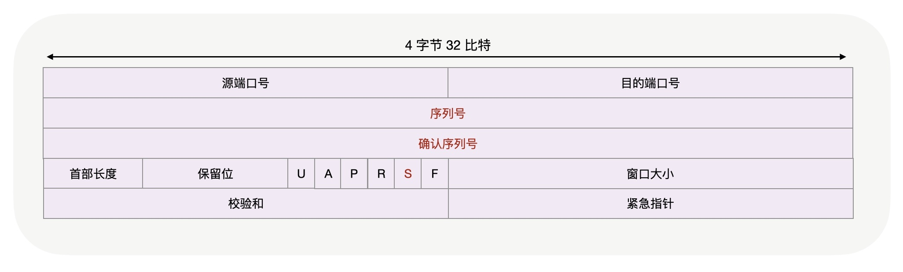
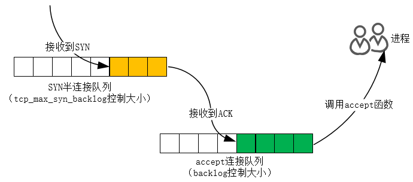

# 9. TCP三次握手

TCP是一个可以双向传输的全双工协议，所以需要经过三次握手才能建立连接。**三次握手在一个HTTP请求中的平均时间占比在10%以上**，在网络状况不佳、高并发或者遭遇SYN泛洪攻击等场景中，如果不能正确地调整三次握手中的参数，就会对性能有很大的影响。


TCP协议是由操作系统实现的，调整TCP必须通过操作系统提供的接口和工具，这就需要理解Linux是怎样把三次握手中的状态暴露给我们，以及通过哪些工具可以找到优化依据，并通过哪些接口修改参数。

## 客户端优化

客户端和服务器都可以针对三次握手优化性能。相对而言，主动发起连接的客户端优化相对简单一些，而服务器需要在监听端口上被动等待连接，并保存许多握手的中间状态，优化方法更为复杂一些。我们首先来看如何优化客户端。

三次握手建立连接的首要目的是同步序列号。只有同步了序列号才有可靠的传输，TCP协议的许多特性都是依赖序列号实现的，比如流量控制、消息丢失后的重发等等，这也是三次握手中的报文被称为SYN的原因，因为SYN的全称就叫做Synchronize Sequence Numbers。



三次握手由操作系统实现，但是在客户端上可以使用netstat命令可以看到**连接的状态是SYN_SENT**。

```
tcp    0   1 172.16.20.227:39198     129.28.56.36:81         SYN_SENT
```

客户端在等待服务器回复的ACK报文。正常情况下，服务器会在几毫秒内返回ACK，但如果客户端迟迟没有收到ACK会怎么样呢？客户端会重发SYN，**重试的次数由tcp_syn_retries参数控制**，默认是6次：

```
net.ipv4.tcp_syn_retries = 6
```

第1次重试发生在1秒钟后，接着会以翻倍的方式在第2、4、8、16、32秒共做6次重试，最后一次重试会等待64秒，如果仍然没有返回ACK，才会终止三次握手。所以，总耗时是1+2+4+8+16+32+64=127秒，超过2分钟。

如果这是一台有明确任务的服务器，你可以根据网络的稳定性和目标服务器的繁忙程度修改重试次数，调整客户端的三次握手时间上限。比如内网中通讯时，就可以适当调低重试次数，尽快把错误暴露给应用程序。

## 服务器优化

当服务器收到SYN报文后，服务器会立刻回复SYN+ACK报文，既确认了客户端的序列号，也把自己的序列号发给了对方。此时，服务器端出现了新连接，状态是SYN_RCV（RCV是received的缩写）。这个状态下，服务器必须建立一个SYN半连接队列来维护未完成的握手信息，当这个队列溢出后，服务器将无法再建立新连接。



Linux下怎样开启syncookies功能呢？修改tcp_syncookies参数即可。

- 0：关闭syncookies功能
- 1：仅当SYN半连接队列放不下时，再启用它
- 2：无条件开启该功能

由于syncookie仅用于应对SYN泛洪攻击（攻击者恶意构造大量的SYN报文发送给服务器，造成SYN半连接队列溢出，导致正常客户端的连接无法建立），这种方式建立的连接，许多TCP特性都无法使用。所以，应当把tcp_syncookies设置为1，仅在队列满时再启用。

```
net.ipv4.tcp_syncookies = 1
```

当客户端接收到服务器发来的SYN+ACK报文后，就会回复ACK去通知服务器，同时己方连接状态从SYN_SENT转换为ESTABLISHED，表示连接建立成功。服务器端连接成功建立的时间还要再往后，到它收到ACK后状态才变为ESTABLISHED。

如果服务器没有收到ACK，就会一直重发SYN+ACK报文。当网络繁忙、不稳定时，报文丢失就会变严重，此时应该调大重发次数。反之则可以调小重发次数。**修改重发次数的方法是，调整tcp_synack_retries参数：**

```
net.ipv4.tcp_synack_retries = 5
```

tcp_synack_retries 的默认重试次数是5次，与客户端重发SYN类似，它的重试会经历1、2、4、8、16秒，最后一次重试后等待32秒，若仍然没有收到ACK，才会关闭连接，故共需要等待63秒。

**服务器收到ACK后连接建立成功，此时，内核会把连接从SYN半连接队列中移出，再移入accept队列，等待进程调用accept函数时把连接取出来。如果进程不能及时地调用accept函数，就会造成accept队列溢出，最终导致建立好的TCP连接被丢弃。**

实际上，丢弃连接只是Linux的默认行为，我们还可以选择向客户端发送RST复位报文，告诉客户端连接已经建立失败。打开这一功能需要将tcp_abort_on_overflow参数设置为1。

```
net.ipv4.tcp_abort_on_overflow = 0
```

**通常情况下，应当把tcp_abort_on_overflow设置为0，因为这样更有利于应对突发流量。**

举个例子，当accept队列满导致服务器丢掉了ACK，与此同时，客户端的连接状态却是ESTABLISHED，进程就在建立好的连接上发送请求。只要服务器没有为请求回复ACK，请求就会被多次重发。如果服务器上的进程只是短暂的繁忙造成accept队列满，那么当accept队列有空位时，再次接收到的请求报文由于含有ACK，仍然会触发服务器端成功建立连接。所以，**tcp_abort_on_overflow设为0可以提高连接建立的成功率，只有你非常肯定accept队列会长期溢出时，才能设置为1以尽快通知客户端。**

那么，怎样调整accept队列的长度呢？

**listen函数的backlog参数就可以设置accept队列的大小。事实上，backlog参数还受限于Linux系统级的队列长度上限，当然这个上限阈值也可以通过somaxconn参数修改。**

```
net.core.somaxconn = 128
```

当下各监听端口上的accept队列长度可以通过ss -ltn命令查看，但accept队列长度是否需要调整该怎么判断呢？还是通过netstat -s命令给出的统计结果，可以看到究竟有多少个连接因为队列溢出而被丢弃。

```
# netstat -s | grep "listen queue"    14 times the listen queue of a socket overflowed
```

如果持续不断地有连接因为accept队列溢出被丢弃，就应该调大backlog以及somaxconn参数。